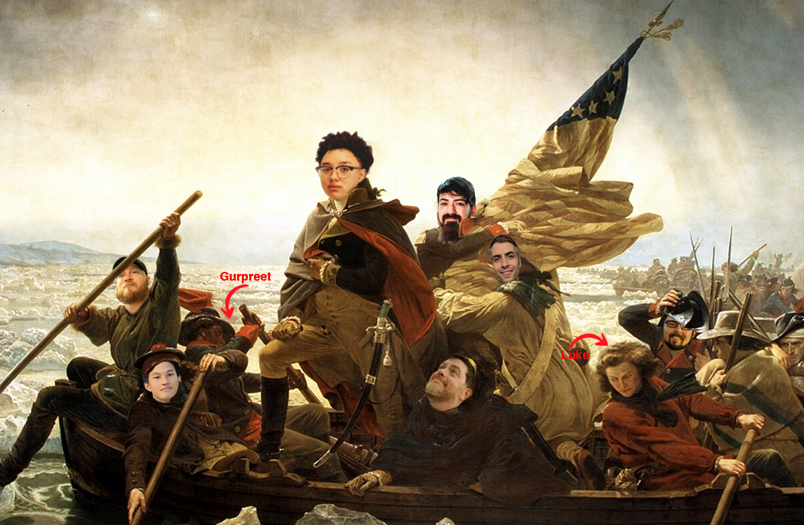
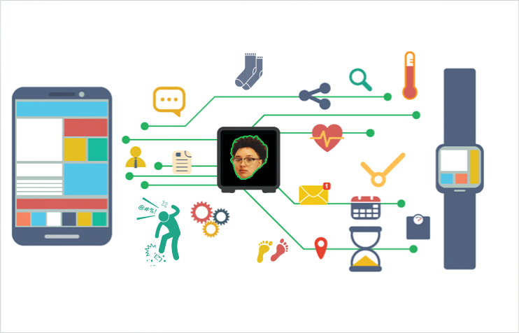

# Introduction

A quick overview of SafeStep-- **SmartSocks for Diabetic Foot Monitoring**.

## The Beginning

It all started with a group of students from Columbus State University, much like the iconic depiction of **George Washington bravely crossing the Delaware**. Just as that pivotal moment was a turning point in history, our project represents a stride towards innovation in healthcare technology. As we navigate through the complexities of developing the SmartSock for diabetic foot monitoring, our journey echoes the daring and determination of those historical figures— with a bit less freezing river water and a lot more programming."

## What is SafeStep?

SafeStep is a **smart sock** that monitors the foot health of diabetic patients. It is designed to help prevent foot ulcers and amputations by providing real-time data on foot temperature and pressure.

**_Video of setting up and using our project are in plan but not a priority. If a video would be helpful, please let us know and we'll get on it!_**

## How does it work?

In theory, SafeStep works by monitoring the temperature and pressure of the foot. It uses sensors embedded in the sock to collect data, which is then transmitted to a mobile app via Bluetooth. The app analyzes the data and alerts the user if there are any signs of potential foot ulcers. Potential signs would be based on the user's standard of 'normal' foot temperature and pressure; which would be determined during a calibration period.

## Tech Stack

SafeStep uses a combination of hardware and software to function. The hardware includes the smart sock itself, which contains the sensors and Bluetooth transmitter. The software includes the mobile app, which receives and analyzes the data from the sock.

- Android Studio
- Flask
- MongoDB
- Raspberry Pi Pico W

## Continuous Innovation

**SafeStep is a work in progress**. We are constantly working to improve the technology and make it more effective at detecting foot ulcers. We are also exploring new ways to use the data collected by the sock to help improve the overall health of diabetic patients.

This project is a collaboration between students from Columbus State University and will be continued to be developed by either our team or future students.

