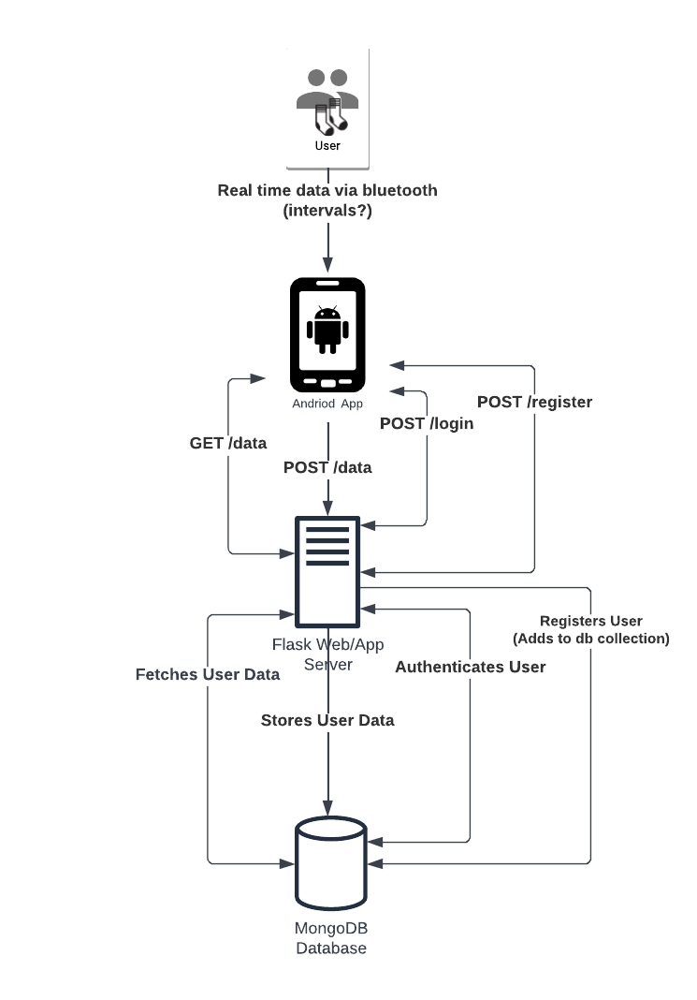

# Architecture

## System Overview
#### How everything works together:

:::note
We do not have all this working functionality. 

This is a high-level overview of what we were working towards and how the system would work together.
:::

1. The SmartSocks are the main hardware component.
   - It contains sensors that monitor foot temperature and pressure. 
   - The data collected by the sensors is transmitted to a mobile application via Bluetooth. 
   - The app analyzes the data and alerts the user if there are any signs of potential foot ulcers or any abnormalities.

2. The mobile app is the main software component. 
    - It receives and analyzes the data from the smart sock. 
    - The app is responsible for alerting the user if there are any abnormalities with their readings.

3. The web server backend is built with Flask. 
    - It is responsible for storing and retrieving data from the MongoDB database.
    - The web server backend provides an API for the mobile app to communicate with the database.

4. The MongoDB database stores the data collected by the smart sock. 
    - The database is used to store historical data and provide insights into the user's foot health over time.
    - It is also used to retrieve data for the mobile app to display to the user via graphs, charts, etc.

5. The user interacts with the mobile app to view real-time data on their foot health. 
    - The app provides alerts and recommendations based on the data collected by the smart sock.
    - Notifications are sent to the user if there are any abnormalities detected in the readings.

6. The user can also view historical data and trends in the mobile app. 
    - This allows the user to track changes in their foot health over time and make informed decisions about their care.

## Deep Dive into the components

#### What we have so far:

### Smart Sock (Prototype - Raspberry Pi Pico W):

- We didn't have the time to actually build out the SmartSocks, but we did manage to create a prototype using a Raspberry Pi Pico W. 
- The prototype contains 8 temperature sensors and 8 pressure sensors (16 sensors total).
- The Pico W sends a BLE advertisement with a GATT service that contains the sensor data in characteristic values.
  - Read more about Bluetooth Low Energy (BLE) [here](https://developer.android.com/develop/connectivity/bluetooth/ble/ble-overview).

### Mobile App

- The mobile application is built with Android Studios using Java.
- The app is responsible for receiving and analyzing the data from the smart sock (Pico, in this case).
- We were able to get a lot of functionality working, such as:
  - Scanning for BLE devices.
  - Connecting to the Pico.
  - Reading the sensor data from the Pico.
  - Displaying the sensor data in intervals.
  - Displaying the sensor data in a chart and heatmap.
  - Profile page
  - Debugging page
  - Registering and logging in users
- For more information on the mobile app, check out the [Android App](/docs/tutorial-basics/android-app) section.

### Web Server Backend

- The web server backend is built with Flask. 
- It is responsible for storing and retrieving data from the MongoDB database. 
- The web server backend provides an API for the mobile app to communicate with the database. 
  - For more information on the web server and the **endpoints** available, check out the [Flask Backend](/docs/tutorial-basics/flask-backend) section.
- The web server is also hosted on [render](https://render.com/) and is accessible via the internet.
  - Please note that we can using the **free tier of render**, by default **the server will go to sleep after 1 hour of inactivity**. 
  This means that the first request after the server has gone to sleep **will take a few minutes/seconds to wake up the server**.

### MongoDB Database

- The MongoDB database stores the data collected by the Pico.
- We have two collections in the database:
  - `users` - stores user information such as username, password and created date.
  - `data` - stores the sensor data collected by the Pico.
- For a deeper dive into the database and the collections, check out the [MongoDB](/docs/tutorial-basics/mongodb) section.

### User Interface

- The user interacts with the mobile app to view their sensor data.
- We have a bar chart and a heatmap that displays the sensor data upon request (doesn't update in real-time).
- The user also has a Profile page where they can view and edit their information, such as: Name, Email, DOB, Weight, Height, Doctor's Name, and Doctor's Email.

### Conclusion

SafeStep is a very comprehensive full-stack project that involves a lot of moving parts.

We made a lot of progress in a short amount of time, especially considering that we were all very new to some the technologies we were using.
SafeStep is a great example of how a team can come together and build something amazing in a short amount of time.

We hope that this project will inspire others to take on similar challenges and build something, no matter how big or small.
